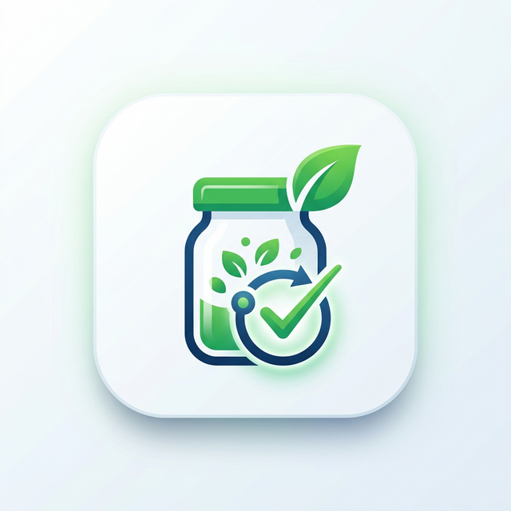

<div align="center">
  
  <h1>Smart Pantry</h1>
  <p>Your intelligent, offline-first food inventory and calorie tracking companion.</p>
</div>

---

## 📱 About The Project

Smart Pantry is a completely local, software-based Android application designed to help you manage your kitchen inventory, reduce food waste, and track your nutritional intake. Built with privacy and speed in mind, all your data—including your account, pantry items, and meal logs—remains securely on your device. No cloud storage, no subscriptions.

The app recently integrated the powerful **USDA FoodData Central API** to make adding items to your pantry faster and more accurate than ever.

## ✨ Key Features

*   **Intelligent Autocomplete Search**: Start typing an ingredient or branded food, and the app will instantly suggest matching products, saving you time.
*   **Automatic Nutritional Data**: Powered by the USDA, selecting a food suggestion automatically fills in calorie counts and standard serving weights for unparalleled accuracy!
*   **Comprehensive Inventory Management**: Track what you have, categorize items (Dairy, Produce, Meat, Pantry, etc.), and monitor quantities and expiration dates.
*   **Expiry & Low Stock Alerts**: The dashboard visually warns you when items are running out (based on your custom minimums) or when they are about to expire.
*   **Calorie Tracking Dashboard**: Log your meals directly from your pantry items. A dynamic MPAndroidChart pie chart breaks down your daily calorie intake against your personal goals.
*   **100% Offline Architecture**: Your user profile (with securely hashed passwords), inventory, and meal logs are stored locally using Android's Room Database.
*   **Modern Material Design UI**: A clean, intuitive interface providing an excellent user experience.

## 🛠️ Built With

*   [Kotlin](https://kotlinlang.org/) - App language
*   [Android Jetpack](https://developer.android.com/jetpack) - Components including Navigation, ViewModels, and LiveData/StateFlow
*   [Room Database](https://developer.android.com/training/data-storage/room) - Local SQLite data persistence 
*   [Retrofit](https://square.github.io/retrofit/) & [OkHttp](https://square.github.io/okhttp/) - For lightning-fast API integration
*   [USDA FoodData Central API](https://fdc.nal.usda.gov/) - Providing world-class nutritional autocomplete data.

## 🔧 How It Works (The USDA API Integration)

One of the standout features of Smart Pantry is its seamless integration with the USDA database:

1.  **Debounced Searching**: As you type a food name into the "Add Item" screen, the app waits for a brief pause (500ms) before querying the USDA API. This ensures smooth performance and prevents network spam.
2.  **Live Suggestions**: The `UsdaApi` service fetches matching foods. `PantryViewModel` updates its internal `StateFlow`, displaying the list in a Material dropdown menu.
3.  **Smart Auto-fill**: When you select a suggestion, the app extracts the item's name and isolates the specific `Energy` (KCAL) nutrient to fill your 'Calories' field. It also converts the USDA's standard serving units (like `g` or `oz`) into the friendly units used in the app interface.
4.  **Local Storage**: When you hit "Save", the complete item is written securely to the local Room database via the `PantryRepository`.

## 🚀 Getting Started

To get a local copy up and running, follow these simple steps.

### Prerequisites

*   Android Studio (Iguana or newer recommended)
*   A free API key from the USDA FoodData Central.

### Installation

1.  Clone the repo:
    ```sh
    git clone https://github.com/Pro7metheus/SmartSync.git
    ```
2.  Get a free API Key at [https://fdc.nal.usda.gov/api-key-signup.html](https://fdc.nal.usda.gov/api-key-signup.html) (It's instant!)
3.  Create a `local.properties` file in the root directory (if it doesn't exist) and enter your API key:
    ```properties
    USDA_API_KEY="ENTER_YOUR_API_KEY_HERE"
    ```
4.  Build and run the project in Android Studio!

## 🔒 Privacy & Security Setup

The application employs `MessageDigest` to create an SHA-256 hash of all user passwords upon account creation. `AuthManager` securely manages sessions using Android's `SharedPreferences` (Private mode) to ensure one user cannot see another user's pantry data on shared devices. All underlying structured data is handled cleanly through Android `Room`.
